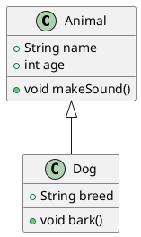
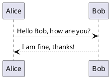
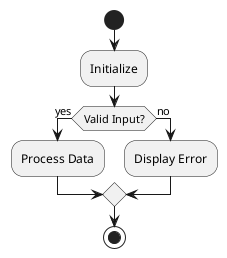
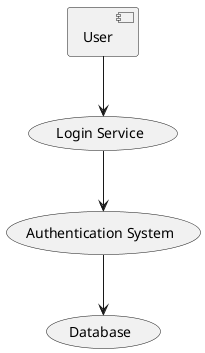

<!---
{
  "id": "04c71741-b965-41c0-936d-62f513e73df6",
  "teaches": "Introduction to PlantUML: Generating Diagrams in Text",
  "depends_on": ["293aa994-02be-42eb-8859-f7e21029a875"],
  "author": "Stephan Bökelmann",
  "first_used": "2025-06-06",
  "keywords": ["PlantUML", "PUML", "diagram", "UML", "Kroki", "SVG", "installation"]
}
--->

# Introduction to PlantUML: Generating Diagrams in Text

> In this exercise you will learn how to install PlantUML and generate diagrams using textual descriptions. Furthermore we will explore how to render different types of diagrams into SVG format, allowing easy integration into documents, websites, or version-controlled repositories.

PlantUML (PUML) is a powerful tool that allows you to create a wide variety of diagrams from plain text descriptions. It is widely used in software documentation, architecture design, and technical communication because it simplifies the creation and maintenance of diagrams. Instead of manually drawing diagrams, you write simple scripts that define the structure and relationships, and PlantUML generates the graphical output for you.

PlantUML supports multiple diagram types, including UML class diagrams, sequence diagrams, activity diagrams, and component diagrams, among others. This textual approach to diagramming offers several advantages: it is version-controllable, human-readable, and easy to automate in CI/CD pipelines. Moreover, diagrams can be updated quickly by editing text, without the need to redraw the entire diagram.

In this exercise, you will start by installing PlantUML directly using your package manager. Then you will create and render four different types of diagrams: class diagram, sequence diagram, activity diagram, and component diagram. You will also learn how to export these diagrams into SVG format, which is ideal for high-quality scalable graphics suitable for web and print usage.

### Further Readings and Other Sources

* [PlantUML Official Documentation](https://plantuml.com/)
* [PlantUML Language Reference Guide (PDF)](https://plantuml.com/guide)
* [Introduction to PlantUML on YouTube](https://www.youtube.com/watch?v=Tv5PHnzsF7s)

---

## Tasks

### Task 0 — Install PlantUML

Install PlantUML directly via `apt`:

```bash
sudo apt install plantuml -y
```

Verify the installation:

```bash
plantuml -version
```

Create a directory for your diagrams:

```bash
mkdir diagrams
cd diagrams
```

### Task 1 — Generate a Class Diagram

Create a text file `class-diagram.puml` with the following content:



Now generate an SVG diagram:

```bash
plantuml -tsvg class-diagram.puml
```

You will see a file `class-diagram.svg` created in your directory.

### Task 2 — Generate a Sequence Diagram

Create `sequence-diagram.puml`:



Generate SVG:

```bash
plantuml -tsvg sequence-diagram.puml
```

### Task 3 — Generate an Activity Diagram

Create `activity-diagram.puml`:



Generate SVG:

```bash
plantuml -tsvg activity-diagram.puml
```

### Task 4 — Generate a Component Diagram

Create `component-diagram.puml`:



Generate SVG:

```bash
plantuml -tsvg component-diagram.puml
```

### Task 5 — Inspect Your Generated SVG Files

After generating the SVG files, it is highly recommended to inspect them. SVG files are plain text files written in XML, which means you can explore both their structure and content.

* Open the file directly in `vim`:

```bash
vim class-diagram.svg
```

* Use `less` to scroll through the file:

```bash
less class-diagram.svg
```

* For a graphical preview, open the file in your web browser or use an online viewer such as [svgviewer.dev](https://www.svgviewer.dev/).

* For advanced inspection and editing, open the SVG in a vector graphic editor such as Inkscape:

```bash
inkscape class-diagram.svg
```

Pay attention to how PlantUML translates your text definitions into SVG shapes and elements. This understanding is especially valuable if you plan to post-process or integrate these diagrams into larger documents or pipelines.

---

## Questions

1. In your own words, explain the advantage of describing diagrams in PlantUML's text format instead of drawing them manually.
2. What is the benefit of generating SVG output compared to raster formats like PNG?
3. Describe the structure of a simple PlantUML script. What key markers define the start and end of a diagram?
4. Open one of your generated SVG files in `vim` or `less`. What XML elements do you observe? Which parts seem to correspond to your original PlantUML definitions?
5. Use Inkscape or `svgviewer.dev` to open one of your SVG files. Can you identify individual diagram elements like arrows, text, or boxes? How would you modify an element manually if needed?
6. When would you prefer to use local PlantUML rendering versus a service like Kroki.io?
7. What potential security considerations might arise when uploading sensitive diagrams to online rendering services?

---

## Advice

While PlantUML running locally offers you full control over diagram generation, it is not the only way to render PUML diagrams. Online services like [Kroki.io](https://kroki.io/) allow rendering diagrams directly via HTTP API without installing any software. Kroki supports multiple diagramming languages beyond PlantUML, such as Mermaid, Graphviz, and BlockDiag. This can be extremely useful for web-based integrations or lightweight setups.

However, relying on online renderers comes with trade-offs. Local rendering via PlantUML ensures you are not dependent on external services, which is critical for sensitive or private projects. On the other hand, Kroki offers quick previews and easy integration for collaborative documents, especially for markdown-based documentation systems like GitLab or MkDocs.

For production or automated pipelines, you might consider hybrid approaches: use PlantUML locally for core development, and online services for lightweight documentation preview. Both approaches have their place depending on the context and constraints of your project.

